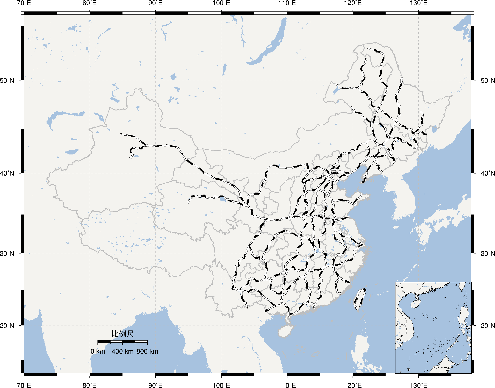

# China's Geospatial Data for GMT

构建中...

## 数据

- [CN_faults.gmt](CN_faults.gmt): 中国断层数据
- [CN-border-La.dat](CN-border-La.dat): 中国国界、省界、十段线以及南海诸岛
- [CN-border-L1.dat](CN-border-L1.dat): 国界、十段线以及南海诸岛数据（不含省界数据）
- [ten-dash-line.dat](ten-dash-line.dat): 仅包含十段线数据
- [CN-capitals.dat](CN-capitals.dat): 中国省会城市坐标
- [CN-EQRegion.dat](CN-EQRegion.dat): 中国地震区域划分边界数据
- [CN-EQRegion-name.dat](CN-EQRegion-name.dat): 中国地震区域划分名称数据
- [CN-EQSubRegion.dat](CN-EQSubRegion.dat): 中国地震区域划分亚区边界数据
- [CN-EQSubRegion-name.dat](CN-EQSubRegion-name.dat): 中国地震区域划分亚区边界数据
- [CN-Railways.dat](CN-Railways.dat): 中国铁路线
- [CN-Rivers.dat](CN-Rivers.dat): 中国一级河流数据
- [CN-block-L1.dat](CN-block-L1.dat): 中国大陆一级地块边界数据
- [CN-block-L1-deduced.dat](CN-block-L1-deduced.dat): 中国大陆一级地块推断边界数据
- [CN-block-L2.dat](CN-block-L2.dat): 中国大陆二级地块边界数据

## 数据预览

### 中国断层数据

### 中国国界、省界及十段线数据

### 中国省会城市坐标数据

### 中国地震区域划分边界数据

### 中国铁路线

### 中国一级河流数据

### 中国大陆及周边活动地块数据

